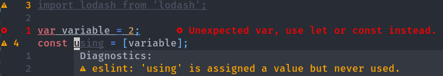

# nvim-custom-diagnostic-highlight

A simple plugin to apply a highlight group to unused variables and functions similar to what [coc-nvim][coc] does.

It can also apply any custom highlight to other diagnostics



Note that the _unused_ fields are darkened.

By default it works for _unused_ fields, but the plugin is configurable for whatever diagnostics you want

## Installation

Simply import the plugin with your favorite package manager and call `.setup` on it

```lua
-- Packer
use {
  'Kasama/nvim-custom-diagnostic-highlight',
  config = function()
    require('nvim-custom-diagnostic-highlight').setup {}
  end
}

-- Plug
Plug 'Kasama/nvim-custom-diagnostic-highlight'
require('nvim-custom-diagnostic-highlight').setup {}

-- ...etc
```

## Basic Usage

By default this plugin registers a diagnostics handler to highlight unused-diagnosed variables, functions, imports, etc.

The most basic usage is to have `require('nvim-custom-diagnostic-highlight').setup {}` in your configurations.

## Configuration

The most up-to-date default configuration can be found at `./lua/nvim-custom-diagnostic-highlight.lua`

The default configuration includes:
```lua
local final_opts = {
  register_handler = true,                                    -- Wether to register the handler automatically
  handler_name = 'kasama/nvim-custom-diagnostic-highlight',   -- The name of the handler to be registered (has no effect if register_handler = false)
  highlight_group = 'Conceal',                                -- The Highlight group to set at the diagnostic
  patterns_override = {                                       -- Lua patterns to be tested against the diagnostic message. Overrides default behavior
    '%sunused', '^unused', 'not used', 'never used',
    'not read', 'never read', 'empty block'
  },
  extra_patterns = {},                                        -- Extra lua patterns to add. Does NOT override and will be added to the above
  diagnostic_handler_namespace = 'unused_hl_ns',              -- Name of the handler namespace that will contain the highlight (needs to be unique)
}
```

Note that both `handler_name` and `diagnostic_handler_namespace` must be unique values

## Advanced usage

This plugin by default is setup to highlight unused variables, but it can be used to add _any_ highlight to _any_ diagnostic.

It can also be used multiple times. The example below sets up once with the default behavior and another highlighting `import` related diagnostics with a custom highlight group.

```lua
local unused_handler = require('nvim-custom-diagnostic-highlight').setup {
  register_handler = false,
  diagnostic_handler_namespace = 'unused_handler'
}
local import_handler = require('nvim-custom-diagnostic-highlight').setup {
  register_handler = false,
  highlight_group = 'MyCustomHighlightGroup',
  patterns_override = { 'import' },
  diagnostic_handler_namespace = 'import_handler'
}

vim.cmd [[highlight MyCustomHighlightGroup ctermfg=168 ctermbg=16 guifg=#e06c75 guibg=#282c34]]

vim.diagnostic.handlers['my/unused'] = unused_handler
vim.diagnostic.handlers['my/import'] = import_handler
```

There are many possibilities.

[coc]: https://github.com/neoclide/coc.nvim
